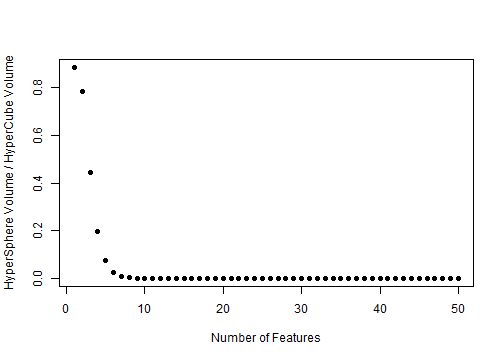

## Project Choice

### Example of k Nearest Neighbors Algorithm
  1. Easy to Understand
  2. Demonstrates Curse of Dimensionality
  3. Highlights Benefits of Scaling and Normalization

Shiny Web-App will use kNN on the [Wisconsin Breast Cancer Data Set](https://archive.ics.uci.edu/ml/datasets/Breast+Cancer+Wisconsin+%28Diagnostic%29)
* 30 Features
* Different Scales for Each Feature in the 'No Scale' Data
* Binary Outcome of Benign or Cancerous

--- class #id

## What is k-Nearest Neighbors?
<div style='text-align: center;'>
    
</div>

Image from [kNN Wikipedia Entry](http://en.wikipedia.org/wiki/K-nearest_neighbors_algorithm)

--- .class #id

## Curse of Dimensionality

* Lots of Variables Results in High-Dimensional Spaces
* Volume of Space Increases so Fast, Data Becomes Sparse
* Are Neighbors Actually Close?

[Curse of Dimensionality Wikipedia Entry](http://en.wikipedia.org/wiki/Curse_of_dimensionality)

Example: Proportion of HyperSphere Volume (range of data point) to HyperCube Volume (Volume of Feature Space)

HyperSphere Vol = $\LARGE\frac{2 r^d \pi^{(d / 2)}}{d \Gamma(d / 2)}$

HyperCube Vol = $\LARGE(2r)^d$

Proportion = $\LARGE\frac{\pi^{(d/2)}}{d 2^{(d-1)}\Gamma(d / 2)}$

--- .class #id

## Growth of Sparse Feature Space

```r
plot((pi*((1:50)/2))/((1:50)*2^((1:50)-1)*gamma((1:50)/2)),
     ylab = "HyperSphere Volume / HyperCube Volume", pch = 19, xlab = "Number of Features")
```

 

Shiny App at: [https://utengr.shinyapps.io/Project/](https://utengr.shinyapps.io/Project/)
